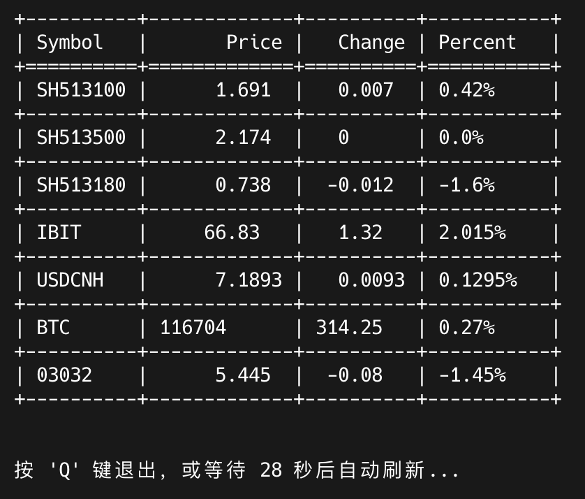

[English Version](README_en.md)

# 带薪看盘 - 股票、外汇、加密货币行情工具

这是一款为上班族和极客打造的股票、外汇、加密货币行情查看工具，提供**图形用户界面 (GUI)** 和 **命令行界面 (CLI)** 两种模式，让您在工作间隙也能轻松、隐蔽地关注市场动态。

GUI 版本名为 **“带薪看盘”**，旨在提供一个功能丰富且不引人注目的看盘体验。CLI 版本则为喜欢高效、简洁操作的用户提供了纯粹的终端解决方案。

## 功能特性

- **双界面支持**：
  - **图形界面 (GUI)**：名为“带薪看盘”，功能强大，交互友好。
  - **命令行界面 (CLI)**：轻量、快速，适合在终端中运行。
- **实时数据**：获取股票（A股、港股、美股）、外汇和主流加密货币的实时报价。
- **自选与指数**：支持自定义的自选列表和固定的指数列表，并可在两者间轻松切换。
- **跨平台运行**：支持 Windows, macOS 和 Linux 系统。

### GUI 版本独有功能

- **系统托盘**：可将程序最小化到系统托盘，并通过全局快捷键 `Ctrl+Alt+Z` 快速隐藏/显示。
- **高级数据显示**：
  - **盘前/盘后**：自由选择是否显示美股的盘前盘后价格。
  - **交易状态过滤**：一键筛选，仅显示仍在交易中的品种。
- **列表管理**：支持通过拖拽对自选股进行排序，并能方便地添加和删除。
- **自定义刷新**：可自定义刷新间隔，随时暂停或手动刷新。

## 界面截图

### 图形用户界面 (带薪看盘)


### 命令行界面


## 安装

1.  克隆或下载本仓库到本地。
2.  确保您已安装 Python 3。
3.  安装所需的依赖库：

    ```bash
    pip install -r requirements.txt
    ```

## 使用方法

### 图形用户界面 (GUI)

运行 `stock.py` 启动“带薪看盘”图形界面：

```bash
python stock.py
```

- **列表切换**：点击“显示自选股”或“显示指数”按钮进行切换。
- **自选股管理**：点击“管理股票”按钮，可以添加、删除或拖拽排序您的自选股。
- **数据显示**：通过复选框控制是否显示美股盘前/盘后数据，或筛选交易中品种。
- **隐藏到托盘**：点击“隐藏到托盘”或使用快捷键 `Ctrl+Alt+Z`。

### 命令行界面 (CLI)

运行 `stock_cli.py` 启动命令行版本：

#### 基本用法

```bash
python stock_cli.py [选项] [股票/外汇/加密货币代码...]
```

#### 选项

-   `-i <秒数>`: 指定刷新间隔的秒数，默认为 30 秒。
-   `-idx`, `--indexes`: 显示指数列表而不是自选股。
-   `-e`, `--ext-data`: 显示美股的盘前盘后价格。
-   `-t`, `--trading-only`: 仅显示正在交易中的市场行情。
-   `-h`, `--help`: 显示帮助信息。
-   `-v`, `--version`: 显示版本信息。

#### 示例

-   **查看默认自选列表**:
    ```bash
    python stock_cli.py
    ```

-   **查看指数列表**:
    ```bash
    python stock_cli.py --indexes
    ```

-   **查看指定股票** (例如：纳指100ETF):
    ```bash
    python stock_cli.py QQQ
    ```

#### 交互

-   在程序运行过程中，按 `q` 键退出。
-   在默认列表模式下，按 `x` 键可在自选股与指数列表间切换。

## 程序打包

您可以使用 PyInstaller 将程序打包为可执行文件，方便在没有 Python 环境的电脑上运行。

1.  **安装 PyInstaller**:
    ```bash
    pip install pyinstaller
    ```

2.  **打包 GUI 版本**:
    ```bash
    # 对于 Windows 和 macOS，--windowed 参数可以隐藏终端窗口
    pyinstaller --onefile --windowed --add-data "favorites.json;." --add-data "indexes.json;." --name="stock" --icon=icon.ico stock.py
    ```

3.  **打包 CLI 版本**:
    ```bash
    pyinstaller --onefile --add-data "favorites.json;." --add-data "indexes.json;." --name="stock_quote_cli" --icon=icon.ico stock_cli.py
    ```

4.  打包完成后，可执行文件将位于 `dist` 目录中。

## 数据源

- **股票数据**：来自腾讯财经 (qt.gtimg.cn)
- **外汇数据**：来自东方财富网 (eastmoney.com)
- **加密货币数据**：来自 528btc (528btc.com)

## 配置文件

程序现在会将配置文件和日志存储在用户的主目录下的一个名为 `.stock_quote` 的文件夹中（例如，在 Windows 上是 `C:\\Users\\YourUsername\\.stock_quote`）。这样做的好处是，即使用户更新或移动了程序，其个人配置（如自选股列表）也能得以保留。

程序首次运行时，会自动在该目录创建和管理以下文件：
- `favorites.json`: 存储您的自选股列表。您可以直接编辑此文件来批量修改自选股。
- `indexes.json`: 存储固定的指数列表。
- `stock_quote.log`: 记录程序运行中的错误，方便排查问题。
