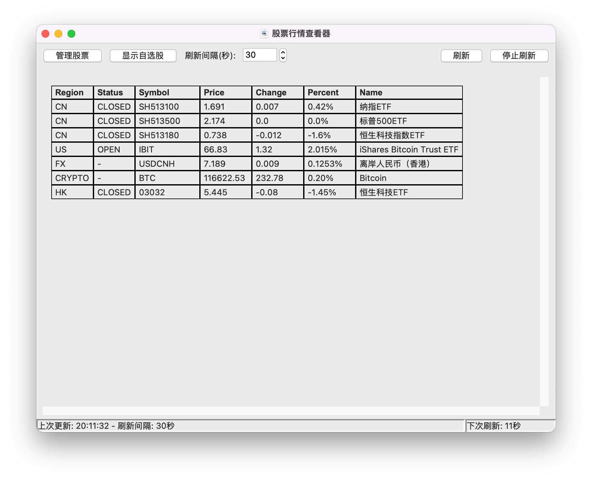

[中文版本](README.md)

# Work-Time Stock Watcher - A Quote Tool for Stocks, Forex, and Crypto

This is a quote-viewing tool for stocks, forex, and cryptocurrencies, designed for office workers and geeks. It offers both a **Graphical User Interface (GUI)** and a **Command-Line Interface (CLI)**, allowing you to easily and discreetly monitor market dynamics during work hours.

The GUI version is named **"Work-Time Stock Watcher"** (带薪看盘), aiming to provide a feature-rich yet unobtrusive market-watching experience. The CLI version offers a pure terminal solution for users who prefer efficient and concise operations.

## Features

- **Dual Interface Support**:
  - **GUI**: Named "Work-Time Stock Watcher," it is powerful and user-friendly.
  - **CLI**: Lightweight and fast, perfect for running in a terminal.
- **Real-time Data**: Get real-time quotes for stocks (A-shares, HK stocks, US stocks), forex, and major cryptocurrencies.
- **Watchlist and Indexes**: Supports a custom watchlist and a fixed list of indexes, with easy switching between them.
- **Cross-Platform**: Runs on Windows, macOS, and Linux.

### GUI Version Exclusive Features

- **System Tray**: Minimize the application to the system tray and use the global hotkey `Ctrl+Alt+Z` to quickly hide/show the window.
- **Advanced Data Display**:
  - **Pre/Post-Market**: Freely choose whether to display pre-market and post-market prices for US stocks.
  - **Trading Status Filter**: One-click filter to show only the symbols that are currently in their trading session.
- **List Management**: Supports drag-and-drop sorting for your watchlist, as well as easy addition and removal of stocks.
- **Custom Refresh**: Customize the refresh interval, and pause or manually refresh at any time.

## Screenshots

### Graphical User Interface (Work-Time Stock Watcher)


### Command-Line Interface
```
+----------+-------------+------------+-----------+
| Symbol   |       Price |     Change | Percent   |
+==========+=============+============+===========+
| USDCNH   |      7.1247 |     0.0038 | 0.05%     |
+----------+-------------+------------+-----------+
| BTC      | 101423      | -1523.61   | -1.48%    |
+----------+-------------+------------+-----------+
| SH513100 |      1.918  |    -0.031  | -1.59%    |
+----------+-------------+------------+-----------+
| SH513500 |      2.374  |    -0.015  | -0.63%    |
+----------+-------------+------------+-----------+
| SH513650 |      1.764  |    -0.024  | -1.34%    |
+----------+-------------+------------+-----------+
| SH513180 |      0.791  |    -0.009  | -1.12%    |
+----------+-------------+------------+-----------+
| HK09988  |    160.7    |    -4.3    | -2.61%    |
+----------+-------------+------------+-----------+


按 'Q' 退出，按 'X' 切换自选/指数，或等待 24 秒后自动刷新...
```

## Installation

1.  Clone or download this repository to your local machine.
2.  Ensure you have Python 3 installed.
3.  Install the required dependencies:

    ```bash
    pip install -r requirements.txt
    ```

## Usage

### Graphical User Interface (GUI)

Run `stock.py` to launch the "Work-Time Stock Watcher" GUI:

```bash
python stock.py
```

- **Switch Lists**: Click "Show Watchlist" or "Show Indexes" to switch between lists.
- **Manage Watchlist**: Click "Manage Stocks" to add, remove, or drag-and-drop to sort your watchlist.
- **Data Display**: Use the checkboxes to control the display of US pre/post-market data or to filter for trading symbols.
- **Hide to Tray**: Click "Hide to Tray" or use the hotkey `Ctrl+Alt+Z`.

### Command-Line Interface (CLI)

Run `stock_cli.py` to launch the command-line version:

#### Basic Usage

```bash
python stock_cli.py [options] [stock/forex/crypto codes...]
```

#### Options

-   `-i <seconds>`: Specify the refresh interval in seconds (default is 30).
-   `-idx`, `--indexes`: Display the index list instead of the watchlist.
-   `-e`, `--ext-data`: Display pre-market and post-market prices for US stocks.
-   `-t`, `--trading-only`: Show only the symbols that are currently in their trading session.
-   `-h`, `--help`: Show help information.
-   `-v`, `--version`: Show version information.

#### Examples

-   **View the default watchlist**:
    ```bash
    python stock_cli.py
    ```

-   **View the index list**:
    ```bash
    python stock_cli.py --indexes
    ```

-   **View a specific stock** (e.g., Nasdaq 100 ETF):
    ```bash
    python stock_cli.py QQQ
    ```

#### Interaction

-   Press `q` to exit during runtime.
-   In the default list mode, press `x` to toggle between the watchlist and the index list.

## Packaging the Application

You can use PyInstaller to package the application into an executable file, which can be run on computers without a Python environment.

1.  **Install PyInstaller**:
    ```bash
    pip install pyinstaller
    ```

2.  **Package the GUI Version**:
    ```bash
    # For Windows and macOS, the --windowed flag hides the terminal window
    pyinstaller --onefile --windowed --add-data "favorites.json;." --add-data "indexes.json;." --name="WorkTimeStockWatcher" --icon=icon.ico stock.py
    ```

3.  **Package the CLI Version**:
    ```bash
    pyinstaller --onefile --add-data "favorites.json;." --add-data "indexes.json;." --name="stock_quote_cli" --icon=icon.ico stock_cli.py
    ```

4.  The executable file will be located in the `dist` directory after packaging.

## Data Sources

- **Stock Data**: From Tencent Finance (qt.gtimg.cn)
- **Forex Data**: From Eastmoney (eastmoney.com)
- **Cryptocurrency Data**: From 528btc (528btc.com)

## Configuration Files

The program now stores configuration files and logs in a folder named `.stock_quote` within your user's home directory (e.g., `C:\\Users\\YourUsername\\.stock_quote` on Windows). This ensures that your personal configurations (like your watchlist) are preserved even if you update or move the application.

On its first run, the program will automatically create and manage the following files in that directory:
- `favorites.json`: Stores your custom watchlist. You can directly edit this file to manage your stocks in bulk.
- `indexes.json`: Stores the fixed list of market indexes.
- `stock_quote.log`: Records errors that occur during runtime for troubleshooting.
